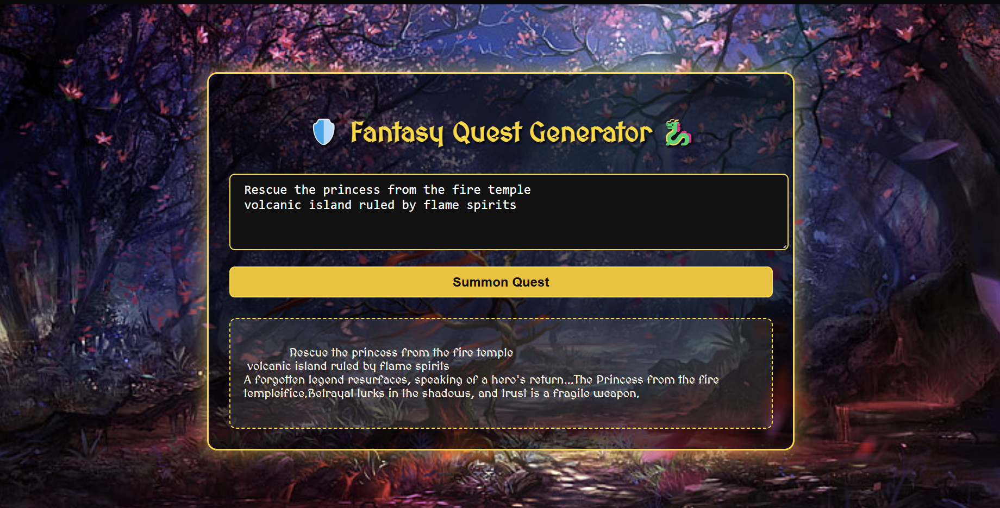
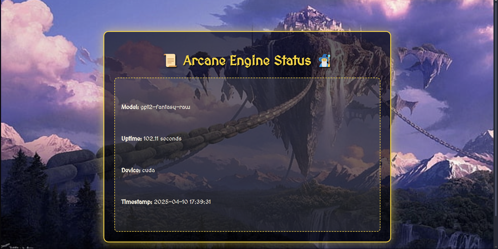

# 🧙‍♂️ Fantasy Quest Generator

A fun and immersive fantasy quest generator powered by a fine-tuned `gpt2-fantasy-raw` model. Built with a medieval-themed UI, this web app lets users input a fantasy prompt and generates detailed quest lines styled like an epic tale.

> ⚔️ *"Rescue the princess from the fire temple... A forgotten legend resurfaces..."*
 ---
## 🔮 How It Works

- **Input**: A short fantasy-themed prompt (e.g., "Slay the ice dragon in the north")
- **Output**: A rich, story-like quest generated using GPT-2 fine-tuned on fantasy data

Example:


🧑‍🌾 Input:
Rescue the princess from the fire temple volcanic island ruled by flame spirits

🧝‍♂️ Output:
Rescue the princess from the fire temple volcanic island ruled by flame spirits a volcanic legend resurfaces...


## 🗂️ Project Structure

```
fantasy-quest-generator/
│
├── static/
│   ├── style.css         # Custom fantasy-themed CSS styles
│   └── background/       # Background images used in the UI
│
├── templates/
│   ├── index.html        # Main frontend interface
│   └── status.html       # Server status interface
│
├── model/
│   └── (Not pushed)      # GPT-2 fine-tuned model (too large for GitHub)
│
├── app.py                # Flask application logic
├── utils.py              # Helper functions (e.g., formatting, timestamping)
├── requirements.txt      # Python dependencies
└── README.md             # You're here!
```

---

## ⚙️ Tech Stack

- **Frontend**: HTML + CSS (Fantasy styled with glowing edges)
- **Backend**: Python Flask
- **Model**: Fine-tuned GPT-2 (`gpt2-fantasy-raw`)
- **Deployment**: GPU-enabled (CUDA) for smooth generation

> 🚫 **Note**: The model is not pushed due to its size. It can be trained easily on any GPU with `transformers` + `Trainer` API.

---

## 💻 Screenshots

### 🎮 Fantasy Quest Generator Interface



---

### 📜 Arcane Engine Status Page



---

## 📚 Dataset & Training

- Created a **custom fantasy quest dataset** with over 500+ labeled prompts and quest completions.
- Preprocessed and tokenized with `GPT2Tokenizer`.
- Fine-tuned GPT-2 (`gpt2`) using PyTorch and HuggingFace Transformers.
- Used:
  - Fantasy-style structure (quest name + description + choice events)
  - Manual curation 

## 🚀 Running Locally

```bash
# Clone the repository
git clone https://github.com/your-username/fantasy-quest-generator.git
cd fantasy-quest-generator

# Install dependencies
pip install -r requirements.txt

# Run the app
python app.py
```

---

## 🏁 Example Prompt

> Input: `Rescue the princess from the fire temple volcanic island ruled by flame spirits`  
> Output: *"A forgotten legend resurfaces, speaking of a hero’s return… The Princess from the fire temple... Betrayal lurks in the shadows..."*

---
## Improvements (Future Work)
Add character creation and background story to link them with quest

Enhance quest branching logic (multi-step outcomes)

Integrate voice generation (TTS) for narration

Add Dark/Light modes for different fantasy themes

Optimize generation using LoRA or QLoRA for smaller models

Containerize with Docker for easier deployment

Adding  more data for better finetuning.


## 📬 Contact

Feel free to reach out if you want to train your own fantasy model or extend this project!

---

🛡️ *Made for fantasy lovers, RPG fans, and dreamers.*
